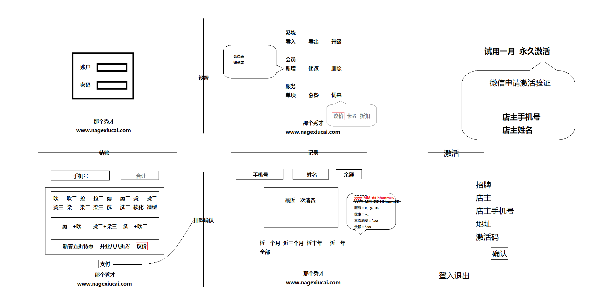

# 简单的会员管理系统

代码风格：写了很多英文单词，突然想中文全拼下。

## TODO
- 将与布局相关的数据表操作放入类属性（目前都在实例初始化方法中）

## 配置
- 店铺

  - 招牌
  - 店主
  - 店主手机号
  - 地址

- 许可

  - 机器锁定
  - 过期设定

## 界面

## 数据表

- 会员

| 手机号 | 姓名 | 余额 | 积分 |
|---|---|---|---|
| 086182029***** | 那个秀才 | 33.33 | 555 |

- 单项

| 编号 | 名称 | 价格 |
|---|---|---|
| X | 吹一 | 30.00 |
| Y | 染一 | 90.00 |
| Z | 洗二 | 88.00 |

- 套餐

| 组合 | 名称 | 价格 |
|---|---|---|
| X+Y | 吹一加染一 | 55.55 |

- 优惠（折扣和卡券）

| 编号 | 活动 | 系数 |
|---|---|---|
| i | 新春五折特惠 | 0.50 |
| j | 开业八八折券 | 0.88 |

- 清单

| 手机号 | 服务元组 | 优惠 | 扣费 | 余额 | 时间戳 |
|---|---|---|---|---|---|
| 086182029***** | 吹一加染一，洗二 | i | 71.78 | 228.22 | yyyy-MM-dd hh:mm:ss |
